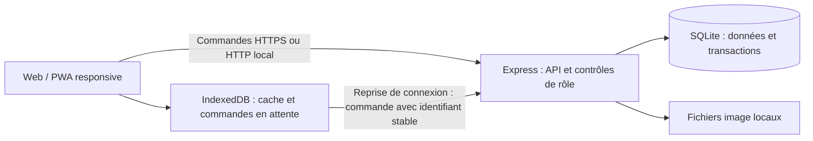
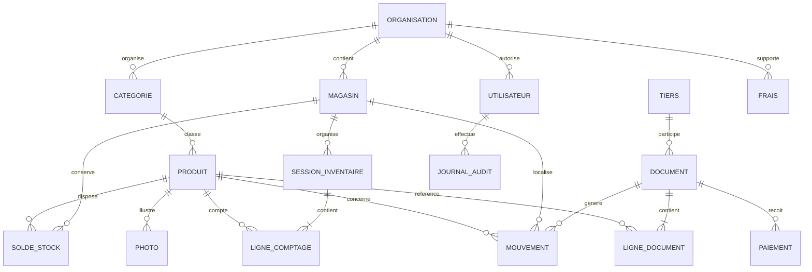

# Comptoir — architecture et progression

L'objectif est une application de gestion commerciale pour les détaillants, supérettes et grossistes du **Bénin**, sur téléphone et ordinateur. La recherche par texte et la saisie manuelle constituent le parcours principal. La monnaie retenue est le franc CFA BCEAO (XOF) et l'identifiant fiscal des tiers est l'IFU. Ce document sépare le premier incrément local des capacités à construire pour une exploitation Cloud.

## Premier incrément

Le socle utilise Node.js 24, Express et SQLite pour une installation simple sur une machine, avec une interface Web responsive en JavaScript. Une PWA permet l'installation sur les appareils compatibles. IndexedDB conserve les données locales nécessaires et les commandes en attente de transmission. Le serveur local reste l'autorité pour les stocks et les paiements.

Les comptes de démonstration servent à vérifier les parcours administrateur, caissier et agent d'inventaire. La configuration de production doit désactiver ces comptes et utiliser un administrateur provisionné par configuration sécurisée. Le périmètre fonctionnel réellement disponible, les commandes de lancement et les limites sont décrits dans le [README](../README.md).

L'authentification locale stocke des mots de passe hachés avec scrypt et des sessions serveur limitées dans le temps ; les jetons de session sont hachés dans SQLite. Le mode production exige le provisionnement initial d'un administrateur et refuse les connexions des comptes publics de démonstration. L'administration du commerce permet de gérer ses magasins et ses comptes, leurs rôles et leur activation. Invitations, récupération de compte en libre-service et autorisations affectées à un magasin restent des évolutions distinctes.

La démonstration Windows est un fichier HTML autonome avec un moteur métier local et des rôles simulés. Les données modifiées sont conservées dans le navigateur. La version serveur vérifie les droits par l'API et utilise SQLite ; cette distinction doit rester visible dans les produits et les documents de livraison.

SQLite convient au prototype et à une instance locale. Plusieurs terminaux peuvent communiquer avec cette instance ; le fichier SQLite ne doit pas être partagé directement par un volume réseau. Il faut déployer un serveur unique avant de tester un usage en boutique.

Le modèle actuel stocke les objets métier en JSON dans SQLite et les soldes par produit/magasin dans une table dédiée. Les commandes sont transactionnelles (`BEGIN IMMEDIATE`) et dédupliquées. Les quantités sont conservées en milli-unités, les montants du prototype en francs CFA XOF entiers ; chaque ligne commerciale est arrondie au franc avant totalisation. Les catégories utilisent des chemins textuels et un produit a une photo. Les documents sont enregistrés directement. Le journal normalisé, les brouillons et le modèle relationnel cible ci-dessous constituent des évolutions explicites.

## Règles métier de la cible complète

Les règles ci-dessous orientent les évolutions ; les paragraphes « premier incrément » indiquent les limites de la version actuellement livrée. Le [dossier de remise](HANDOFF.md) et le [guide de déploiement](DEPLOYMENT.md) définissent les conditions pratiques de publication du pilote.

### Stock et documents

- Un document passe de brouillon à validé. La validation et les mouvements associés sont enregistrés dans une même transaction ; un brouillon ne modifie aucun stock.
- Le journal de stock validé est immuable. Une correction produit un mouvement compensatoire lié à l'original. Une référence ayant un historique est archivée plutôt que supprimée.
- Un achat augmente le stock, une vente le diminue et un transfert enregistre deux mouvements liés, dans les magasins source et destination. La somme d'un transfert doit être nulle.
- Les ajustements indiquent un motif et un auteur. Les pertes, la casse, les péremptions et les corrections d'inventaire restent distinguables dans les rapports.
- Un solde par produit et magasin sert aux recherches rapides. Il est mis à jour dans la même transaction que le journal et doit pouvoir être reconstruit depuis celui-ci.
- Une sortie ne peut pas dépasser le stock disponible selon la politique choisie. Le contrôle et la mise à jour doivent être atomiques : deux ventes simultanées ne peuvent pas utiliser chacune le même dernier article.

La référence SKU est unique dans une organisation, même lorsqu'un produit est présent dans plusieurs magasins. Une catégorie peut avoir un parent ; un magasin, une zone et un emplacement ne sont pas une catégorie. Les unités (pièce, kg, litre, carton) doivent être explicites. La conversion carton → pièce nécessite un facteur propre au produit, pas une simple modification du libellé.

Le premier incrément refuse le changement d'unité si l'article a du stock, un document ou une ligne d'inventaire. Un article encore inutilisé avec un stock nul peut être modifié. Les lignes des documents conservent le nom, le SKU et l'unité historiques du produit.

L'annulation d'un document non payé est réservée à l'administrateur et exige un motif. Elle conserve l'original, le marque annulé et enregistre un document inverse lié, dans la même transaction que les mouvements compensatoires. Les ventes, achats, transferts et ajustements manuels sont concernés ; l'ajustement d'un inventaire validé ne peut pas être annulé par cette voie. L'original annulé et son inverse sont exclus des ventes, marges et dettes actives. Si un paiement a été reçu, l'opération est refusée : les remboursements restent à implémenter et ne peuvent pas être remplacés par une correction fictive d'encaissement.

### Montants, quantités et valorisation

Les montants sont des entiers en unité monétaire mineure. Le nombre de décimales dépend de la monnaie : XOF n'a pas de centimes, EUR en a deux. L'organisation définit une monnaie comptable ; un document stocke cette monnaie et ses prix historiques. Les calculs financiers ne reposent pas sur des flottants binaires.

Les quantités sont des entiers à échelle fixe, par exemple des milli-unités (`1,250 kg` = `1250`). La précision autorisée dépend de l'unité ; une pièce est normalement entière. Les opérations montant × quantité appliquent une règle d'arrondi explicite, avec contrôle des dépassements d'entiers. Les conversions et les arrondis doivent être partagés entre clients et serveur.

La valorisation de stock utilise une méthode définie, par exemple le coût moyen pondéré. Un achat met à jour le coût moyen ; une vente mémorise le coût des marchandises vendues au moment de sa validation. Le bénéfice brut réalisé est le chiffre d'affaires moins ce coût. Le bénéfice net soustrait ensuite les frais généraux de la période. `Ventes − achats de la période` n'est pas un bénéfice : une partie des achats peut encore être en stock.

La marge estimée sur le stock représente un potentiel commercial. Elle ne doit pas être présentée comme un bénéfice déjà réalisé. Taxes, remises, retours, devise et règles comptables locales feront l'objet d'un incrément explicite avant de produire des documents fiscaux.

Dans le premier incrément, une vente mémorise le prix d'achat de référence de la fiche produit. Les indicateurs de marge utilisent ce coût historique et les frais de la période, mais restent estimatifs : les achats ne recalculent pas encore un coût moyen pondéré et les changements de coût réels ne sont pas intégralement valorisés.

Le mode « sans prix » masque les données financières dans les parcours et les exports concernés. Il ne donne aucun droit supplémentaire ; les restrictions du rôle s'appliquent aussi à l'API.

### Paiements et tiers

Chaque paiement référence un document, une date, un montant, un mode et un auteur. La dette restante provient du total validé moins les paiements acceptés. Les trop-perçus, remboursements et annulations nécessitent des opérations identifiables. Une modification ultérieure de la fiche client ou fournisseur ne doit pas changer les coordonnées historiques d'une facture.

Les rôles client et fournisseur peuvent coexister sur un même tiers. Leur historique est accessible par organisation et magasin selon les autorisations. L'IFU reste un champ textuel ; sa présence ne prouve pas sa validité fiscale. Les données et identifiants de démonstration sont fictifs.

Dans le premier incrément, une fiche a un seul type, client ou fournisseur. Dès qu'un document la référence, ce type ne peut plus être changé ; une fiche séparée permet le second rôle. Les coordonnées restent modifiables.

### Inventaire et concurrence

Une session sélectionne des produits et une zone ou catégorie, mémorise le stock théorique et la version de chaque solde, puis reçoit les quantités comptées. Une quantité non renseignée n'est pas assimilée à zéro.

Si des mouvements ont eu lieu depuis le snapshot, la validation doit refuser la correction automatique et demander un rapprochement ou un nouveau comptage. Cela évite de perdre les ventes réalisées pendant le comptage. Une alternative de production consiste à figer la zone, ou à définir une heure de coupure et intégrer explicitement les mouvements intervenus après celle-ci.

La validation applique l'écart comme ajustement documenté, atomiquement et une seule fois. Les lignes comptées, l'écart et l'auteur restent consultables après validation.

## Rôles et isolation

| Capacité | Administrateur | Caissier / vendeur | Agent d'inventaire |
| --- | --- | --- | --- |
| Catalogue et recherche | Lecture et modification | Lecture autorisée | Lecture nécessaire au comptage |
| Coûts d'achat, marges, rapports financiers | Oui | Non | Non |
| Ventes et encaissements | Oui | Oui | Non |
| Achats, ajustements, transferts, frais | Oui | Non | Non |
| Comptage | Oui | Non | Saisie dans ses sessions |
| Validation d'inventaire | Oui | Non | Non |
| Utilisateurs et paramétrage | Oui | Non | Non |

Pour le premier incrément serveur, les rôles portent sur l'ensemble du commerce et ses magasins. L'administrateur crée les comptes réels et gère leur rôle, activation et mot de passe. Les opérations d'administration des utilisateurs passent par des routes API dédiées et exigent une connexion au serveur ; les mots de passe ne sont pas enregistrés dans la file hors-ligne. La désactivation et les changements d'adresse, rôle ou mot de passe révoquent toutes les sessions du compte concerné ; un changement de nom seul les conserve. Le serveur empêche de désactiver ou rétrograder le dernier administrateur réel actif.

Les droits sont vérifiés sur chaque route API et chaque objet demandé. Masquer un bouton ou une colonne ne protège pas les données. Les réponses, recherches, exports et le cache local d'un rôle restreint excluent les prix d'achat et les marges. Le cache est effacé à la déconnexion et lors d'un changement de compte.

La version serveur rattache les nouveaux comptes à une organisation (`tenant_id` sur les utilisateurs et `tenantId` sur les enregistrements métier). Les accès métier sont exécutés dans le périmètre obtenu en base depuis l'utilisateur authentifié, avec restauration de ce périmètre après chaque opération synchrone. Les stocks sont associés aux identifiants uniques des produits et magasins de ce périmètre. Les fichiers image possèdent leur propre table d'appartenance. Les anciennes données sans organisation restent dans le périmètre historique, inaccessible aux nouveaux inscrits. Les contraintes SKU et les numéros de documents sont évalués par commerce. Les tests HTTP vérifient lecture, écritures, utilisateurs et images entre deux commerces indépendants.

L'inscription conserve une demande temporaire contenant un mot de passe et un code hachés avec scrypt, une date d'expiration, le nombre d'essais et les informations de boutique. Le code provient du générateur cryptographique, expire après 15 minutes et est limité à cinq essais. La validation crée le compte administrateur, l'organisation, le magasin et la session dans une transaction, puis supprime la demande. Le transport capture les messages en mémoire pour les tests ; la production utilise SMTP chiffré et refuse une configuration manquante. La récupération de mot de passe et la sélection de plusieurs organisations par une même adresse restent à réaliser.

Le déploiement du pilote vérifie le refus des comptes de démonstration, les restrictions API, la révocation des sessions, la politique de cookies, la protection d'origine et la limitation des tentatives. Il fournit HTTPS et configure explicitement l'origine et le proxy de confiance. Les secrets restent dans la configuration du déploiement. L'invitation, la récupération en libre-service, l'affectation par magasin et un journal d'audit complet restent dans les étapes suivantes.

## Modèle de données cible

Ce schéma décrit la cible complète. Il ne signifie pas que toutes ces tables existent dans le premier incrément.

Principales contraintes et index :

- Produit : unicité `(organisation_id, sku)` ; index catégorie, marque et état actif. Recherche initiale par nom, SKU, tags et emplacement, puis index plein texte normalisé pour les grands catalogues.
- Solde : unicité `(organisation_id, magasin_id, produit_id)` et version incrémentée à chaque mouvement.
- Mouvement : index `(organisation_id, magasin_id, date, id)` et `(organisation_id, produit_id, date)` ; référence vers le document et son auteur.
- Document : numéro unique dans son périmètre, état, horodatages et version. Ses lignes conservent quantité, prix, remise, taxe et coût au moment de validation.
- Paiement : index document et date. Le total de paiements se contrôle transactionnellement.
- Session et ligne de comptage : un produit par session ; stock et version de référence enregistrés ; version de session pour éviter l'écrasement des saisies.
- Commande de synchronisation : unicité `(organisation_id, appareil_id, operation_id)` ; empreinte du contenu et résultat mémorisé. Le même identifiant avec un autre contenu est rejeté.

Les dates persistées sont en UTC ; la cible définit l'affichage et les périodes de rapport selon le fuseau du commerce, `Africa/Porto-Novo` pour le Bénin. Les exportations indiquent devise, unité, période, magasin et date de génération.

## Hors-ligne et synchronisation

La PWA met en cache sa coque applicative. IndexedDB contient un sous-ensemble autorisé des données et une outbox de commandes, chacune avec un UUID stable, un appareil, un utilisateur, une date locale, une version de référence et un état : en attente, envoyée, acceptée, rejetée ou en conflit. Une commande rejetée reste visible et n'est pas assimilée à un succès.

Le serveur valide les droits au moment de la réception, recalcule les effets métier, applique la commande dans une transaction et mémorise son résultat d'idempotence. Une coupure après validation peut entraîner un nouvel envoi ; le même identifiant renvoie le même résultat sans doubler le stock ou les encaissements. L'idempotence n'arbitre pas les modifications concurrentes.

Politiques de conflit proposées :

| Donnée / action | Politique |
| --- | --- |
| Champs descriptifs du catalogue | Version attendue ; conflit présenté à l'utilisateur |
| Stock | Commandes additionnelles validées par le serveur ; pas de remplacement global du solde |
| Vente hors-ligne | Brouillon/en attente jusqu'à acceptation ; rejet possible si stock devenu insuffisant |
| Comptage | Version du stock requise ; rapprochement obligatoire si le théorique a changé |
| Paiement | Identifiant stable, contrôle de dette et autorisation au serveur |
| Suppression | Archivage ou tombstone propagé ; pas de résurrection automatique |

Deux appareils hors-ligne ne peuvent pas garantir l'absence de survente sans stock réservé par appareil, quotas, ou interdiction des sorties hors-ligne. La première version doit signaler cette limite. Une date locale ne peut pas déterminer l'ordre comptable : l'ordre de validation serveur fait foi.

La synchronisation Cloud de production reste à construire : journal de changements incrémental avec curseur, tombstones, rechargement après expiration du curseur, isolation des organisations, authentification renouvelable, observabilité des conflits et gestion des photos. Une outbox locale vers un seul serveur ne suffit pas à démontrer cette infrastructure.

Le premier incrément relance l'envoi à la reconnexion et périodiquement tant que l'application est ouverte. Si la session expire, les commandes restent enregistrées par utilisateur et attendent une nouvelle connexion du même compte. Un rejet métier conserve son motif et n'est pas relancé comme une simple coupure réseau.

## Plateformes, imports et impressions

La première étape livre le Web responsive/PWA. Android et iOS peuvent ensuite recevoir une application Expo/React Native partageant un domaine TypeScript, les schémas d'API et les règles de validation. L'interface native et son stockage SQLite restent spécifiques. Capacitor constitue une option si les essais PWA montrent que l'interface Web suffit ; il faut valider les exigences matérielles avant ce choix.

L'import CSV commence par une prévisualisation et la validation des colonnes, unités, SKU, nombres et doublons. L'import n'écrase pas silencieusement les produits existants. Excel `.xlsx` arrive ensuite avec les mêmes contrôles. Les exports doivent neutraliser les cellules CSV susceptibles d'être interprétées comme des formules et respecter le rôle.

Une feuille d'impression Web permet le PDF via la boîte de dialogue du navigateur. La génération PDF serveur, la numérotation commerciale et les bordereaux dédiés viennent ensuite. Le Bluetooth, les imprimantes Wi-Fi et les protocoles ESC/POS nécessitent des adaptateurs par plateforme et des tests sur des modèles précis. Une fonctionnalité Web Bluetooth ne couvre pas universellement iOS et toutes les imprimantes.

La facturation normalisée du Bénin et l'intégration **e-MECeF** constituent un incrément dédié. Il exige les contrats d'API, accès, procédures et exigences officiels, puis des essais de conformité. Aucun connecteur ni certification fiscale n'est fourni dans le premier incrément ; un reçu imprimé et un IFU renseigné ne suffisent pas.

Les photos passent par contrôle de format et de taille, noms générés et stockage séparé des documents. Le Cloud utilisera un stockage objet avec URLs autorisées et une politique de rétention.

## Sauvegardes et exploitation

Un export JSON ou CSV est un échange de données, pas une sauvegarde complète et restaurable. Une sauvegarde doit inclure la base, les photos, les paramètres nécessaires et un manifeste avec version et contrôles d'intégrité.

Le premier incrément fournit des outils de sauvegarde locale : snapshot SQLite via son API de sauvegarde, images, manifeste SHA-256 et vérification des références du catalogue. La planification est activée par `STOCK_BACKUP_DIR` ; elle lance une sauvegarde au démarrage, puis selon `STOCK_BACKUP_INTERVAL_HOURS` (24 heures par défaut), et conserve `STOCK_BACKUP_RETENTION` sauvegardes (7 par défaut). La restauration exige un service arrêté et une destination neuve, vérifie l'intégrité et révoque les sessions restaurées. Les commandes se trouvent dans [BACKUPS.md](BACKUPS.md).

La copie vers un stockage extérieur et sa surveillance font partie de la prestation d'hébergement. Des sauvegardes conservées sur le disque de production ne couvrent pas la perte de ce disque.

En SQLite, utiliser l'API de sauvegarde ou une procédure cohérente avec le mode WAL ; copier seulement le fichier principal pendant des écritures peut perdre des données. En Cloud, utiliser PostgreSQL avec sauvegardes automatisées et restauration à un instant donné, plus un stockage objet versionné pour les images. Définir rétention, chiffrement, contrôle d'accès, stockage hors de l'instance et fréquence selon les objectifs de perte de données et de délai de reprise.

Les tâches planifiées doivent être surveillées. Une restauration vers une instance isolée, puis les vérifications des relations, soldes, documents et photos, font partie des critères de mise en production.

## Livraison étape par étape

| Étape | Livraison | Critère de passage |
| --- | --- | --- |
| 1. Pilote serveur et démonstration | Catalogue, magasins configurables, comptes et rôles, mouvements, annulation non payée, inventaire, sauvegardes locales et interface responsive | Tests métier et navigateur, restrictions API, concurrence et restauration ; périmètre démo clairement indiqué |
| 2. Cloud sécurisé | PostgreSQL, organisations, sessions de production, HTTPS, stockage objet et migrations | Isolation entre commerces, contrôle des magasins, charge et restauration |
| 3. Gestion commerciale | Documents brouillon/validé, journal normalisé, retours, achats, valorisation et frais | Totaux et dettes exacts ; bénéfice basé sur le coût des ventes ; corrections auditables |
| 4. Synchronisation et hors-ligne | Domaine TypeScript partagé, journal incrémental, outbox persistante, cache par rôle et conflits | Coupure/reprise, redémarrage, double envoi, deux appareils, rôle révoqué et stock insuffisant |
| 5. Applications mobiles | Expo/React Native ou Capacitor validé, adaptation tactile, stockage local, connectivité | Essais Android/iOS réels, mises à jour, mode avion et gestion des sessions |
| 6. Échanges et facturation | Import Excel, PDF, tickets, bordereaux, adaptateurs imprimantes et e-MECeF | Fichiers représentatifs, arrondis, exigences fiscales officielles du Bénin et matériel compatible |
| 7. Exploitation | Copies de sauvegarde extérieures, audit, alertes, performances et documentation opérateur | Restauration complète, objectifs de reprise mesurés et pilote en magasin |

Ces étapes sont itératives : chaque livraison conserve les invariants du journal, les protections API et les tests déjà validés. Les comptes de démonstration et les hypothèses fiscales sont retirés ou résolus avant toute exploitation commerciale.
